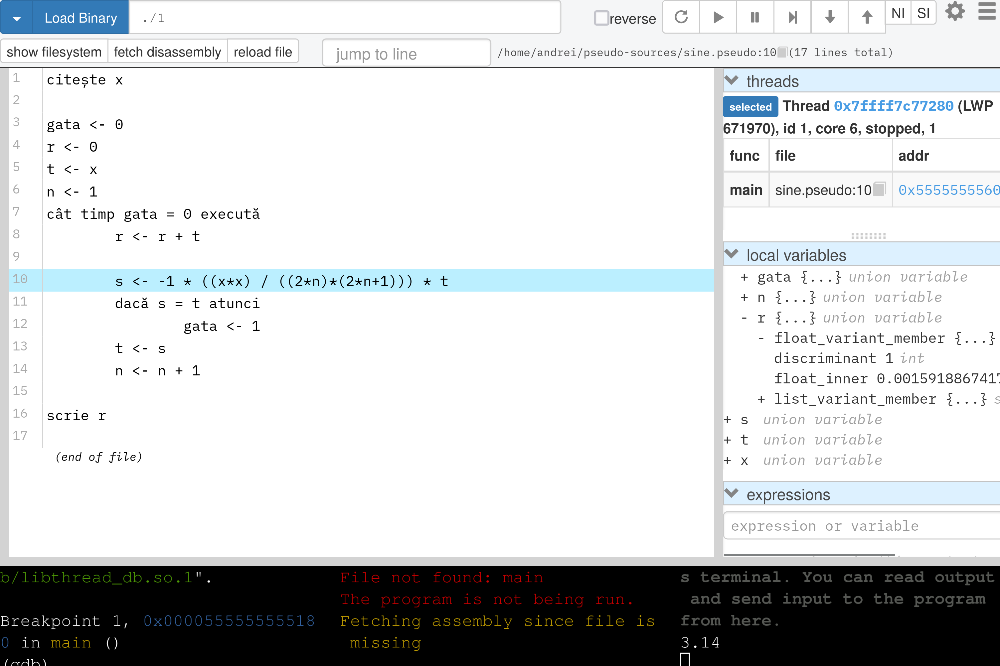
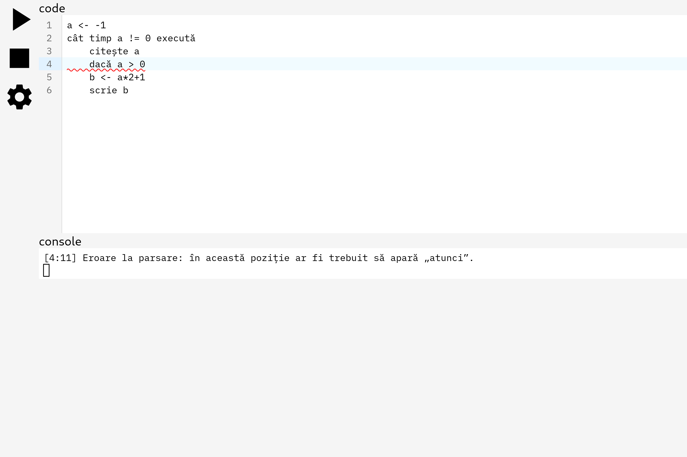

# Pseudocode Compiler

This is a compiler for a dialect of Psedocode, which is part of the high school
Computer Science curriculum in Romania, and of the Baccalaureate Computer
Science exam.

Here's an algorithm for finding the divisors of a number, in Pseudocode:

```
citește a

i <- 1
cât timp i*i <= a execută
	dacă a%i = 0 atunci
		scrie i
		dacă i != a atunci
			scrie a/i
	i <- i+1
```

Pseudocode can be classified as an imperative programming language. There are no
user-defined functions nor classes, but there is support for mathematical
expressions with common operators, branching, looping, and console I/O.

The following is a selection of intriguing facts about the Pseudocode compiler:

- The executables generated by the compiler can be debugged using most common
  debuggers (e.g., `gdb`, `lldb`)
- All the keywords are in Romanian, with (optional) diacritics[^1]: `citește`,
  `dacă`, `execută`, ...
- Some keywords include a space character: `cât timp`, `până când`.
- There are some operators which are (likely) absent from other languages:
  - `x|y` (not binary or), which returns true if `x` divides `y`, and false
    otherwise (i.e. `3|6` is true, and `3|7` is false)
  - `[x]`, which returns the integer part of `x` (i.e. `[3.14]=3`)

<figure>
<figcaption>Debugging Pseudocode in gdbgui</figcaption>	

</figure>

<figure>
<figcaption>Writing Pseudocode in the editor bundled with the compiler</figcaption>	

</figure>

### Codebase

This codebase consists of:

- [pseudo/](pseudo/), the compiler itself
- [editor-frontend/](editor-frontend/) and [editor-backend/](editor-backend/),
  front- and backend of a web-based Pseudocode editor
- [docs/](docs/), my Bachelor thesis, which details the design and
  implementation of Pseudocode in exquisite detail

Some of the techs which were used:

- The dependencies are managed by [Nix](https://nixos.org/).
- The compiler is written in [Rust](https://www.rust-lang.org/), using an
  [LLVM](https://llvm.org/) wrapper called
  [Inkwell](https://github.com/TheDan64/inkwell), to handle the heavy lifting of
  compilation.
- The editor frontend is written TypeScript, using
  [CodeMirror](https://codemirror.net/).
- The editor backend is written in Python, using
  [Starlette](https://www.starlette.io/).
- The thesis is written in [Typst❤️](https://typst.app/).

### Running

To build and run the compiler, you must first install [Nix](https://nixos.org/).
After having installed Nix, run the following command in the root directory of
the repo:

```bash
nix develop
```

Nix will automatically pull the necessary dependencies, and set up the
environment.

Once you're in the `nix develop` environment, use the `pseudo/compile.py`
script[^2] to compile a source file (e.g. `./code.pseudo`) into an executable
(e.g. `./code`):

```bash
python pseudo/compile.py ./code.pseudo ./code --executable
```

[^1]: Diacritics are the `ăâîșț` letters.

[^2]:
    The `pseudo/compile.py` will automatically compile the compiler (+ a shared
    object which it needs to be able to generate executables), then execute it,
    while passing it some necessary arguments, along with your CLI arguments.
